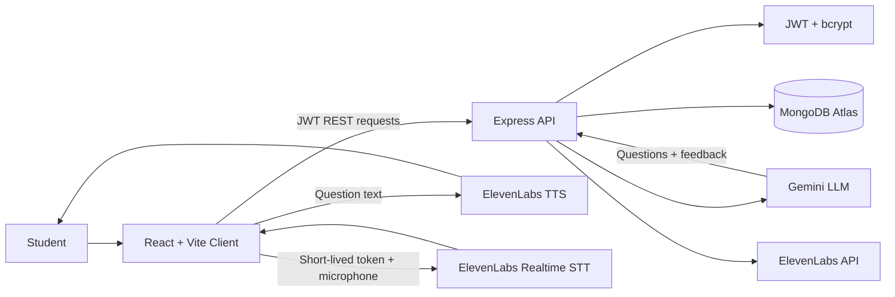

<div align="center">

# MockInt

### Practice interviews. Speak naturally. Improve with evidence.

[](https://mockint-sand.vercel.app/)
[](client/)
[](server/)
[](server/src/services/geminiService.js)

[Open the live demo](https://mockint-sand.vercel.app/)

</div>

---

## Overview

MockInt is an AI-powered mock interview platform for practicing realistic technical interviews. It combines a voice layer, an adaptive interview engine, and an evidence-based evaluation system in one workflow.

The student configures an interview with a resume, target role, difficulty, question count, and duration. Gemini generates personalized questions and feedback, ElevenLabs provides text-to-speech and speech-to-text capabilities, Express coordinates the application logic, and MongoDB stores the complete interview history.

## Architecture



### Responsibility split

| Layer | Responsibility |
| --- | --- |
| **React + Vite** | Routes, authentication state, interview room, voice controls, transcripts, feedback, history, and profile views |
| **Express** | REST API, validation, authorization, interview lifecycle, Gemini orchestration, and voice-service proxying |
| **Gemini** | Personalized first questions, adaptive follow-up or new-topic questions, and structured evaluation |
| **ElevenLabs** | Converts AI questions to speech and provides realtime speech-to-text for candidate answers |
| **MongoDB Atlas + Mongoose** | Persists users, interview configuration, conversation messages, status, timestamps, and feedback |
| **JWT + bcrypt** | Protects routes and stores passwords as hashes rather than plaintext |

## How It Works

### 1. Create an account

The student submits the signup form in React. The client sends `POST /api/auth/signup`. Express validates the request, hashes the password with bcrypt, and saves the user in MongoDB.

The raw password is never persisted.

### 2. Log in securely

The student submits email and password through `POST /api/auth/login`. The server compares the password with the stored bcrypt hash and returns a signed JWT. The client sends that token as:

```http
Authorization: Bearer <JWT>
```

Protected routes use the JWT to identify the current user.

### 3. Configure an interview

On **Create Interview**, the student provides:

- Resume text
- Target role
- Difficulty: easy, medium, or hard
- Number of questions: 1 to 20
- Duration: 1 to 120 minutes

React sends this configuration to `POST /api/interviews`.

### 4. Generate the first question

Express uses the authenticated user ID and validates the interview configuration. It sends the resume, target role, difficulty, question count, and duration to Gemini.

Gemini returns structured JSON containing one concise spoken question, its topic, and its difficulty. The server stores the interview and its first interviewer message in MongoDB, then returns the interview state to the client.

### 5. Speak the question

The client sends the question text to the protected `POST /api/tts` endpoint. The server calls ElevenLabs and streams the resulting audio back as a blob. The browser plays the audio so the student can hear the interviewer.

### 6. Capture a voice answer

When the student starts answering, React requests a short-lived token from `GET /api/stt/token`. The backend obtains that token from ElevenLabs without exposing the permanent API key to the browser.

The browser uses the token to stream microphone audio to ElevenLabs realtime STT. The live transcript is displayed in the interview room.

### 7. Submit the answer

The student explicitly finishes the answer. React sends the final transcript to `POST /api/interviews/:id/answer`.

The backend verifies that the interview belongs to the authenticated user and is still active, appends the candidate response to the conversation, and decides whether to continue or finish.

### 8. Generate the next adaptive question

For the next question, Gemini receives:

```text
Resume + target role + difficulty + question limit
+ complete conversation history + questions already asked
```

It chooses between:

- A meaningful follow-up based on the latest answer
- A new relevant topic that has not been sufficiently explored

The prompt instructs Gemini to ask exactly one concise question, avoid repeated or semantically equivalent questions, personalize questions with the resume, and adjust difficulty when appropriate.

The new question is saved in MongoDB before the client receives it. This makes the backend the source of truth for interview state.

### 9. Complete or cancel the interview

The interview continues until the question limit is reached, the student completes it, or the student cancels it. The API enforces the lifecycle states:

```text
created -> in_progress -> completed
                     \-> cancelled
```

The final actions are:

- `POST /api/interviews/:id/complete`
- `POST /api/interviews/:id/cancel`

Invalid operations, such as answering a completed interview, are rejected by the backend.

### 10. Generate evidence-based feedback

After completion or cancellation, Gemini evaluates the available resume and conversation evidence. It returns structured feedback for:

- Technical ability
- Project knowledge
- DSA
- CS fundamentals
- Behavioral ability
- Communication
- Overall performance

Each category receives a score from 0 to 10 when there is enough evidence. Otherwise, the evaluator returns `insufficient_evidence` instead of guessing. It also provides a summary, strengths, weaknesses, and specific improvement suggestions.

### 11. Review history

The completed interview and feedback are persisted with the user's ID. The History page calls `GET /api/interviews`, so each student sees only their own sessions. A detail view exposes the saved configuration, full Q&A conversation, status, and feedback.

## Technology Stack

### Frontend

- **React 18** for the interactive application UI
- **Vite** for development and production builds
- **React Router** for public and protected routes
- **Tailwind CSS** for styling
- **Radix UI** and **class-variance-authority** for reusable UI primitives
- **Lucide React** for interface icons
- **ElevenLabs React/client SDKs** for the browser voice experience

### Backend

- **Node.js** runtime
- **Express.js** REST API
- **Mongoose** and **MongoDB** for data modeling and persistence
- **JWT** for authentication tokens
- **bcrypt** for password hashing
- **express-validator** for request validation
- **Multer** for multipart form handling where required
- **CORS** and **dotenv** for deployment and environment configuration

### AI and voice

- **Google Gemini** via `@google/genai` for question generation and evaluation
- **ElevenLabs** via `@elevenlabs/elevenlabs-js` for TTS and realtime STT token generation

## Project Structure

```text
ai-interviewer/
├── client/
│   ├── src/
│   │   ├── components/       Reusable UI and protected-route components
│   │   ├── context/          Authentication context
│   │   ├── pages/            Login, dashboard, interview, feedback, and history screens
│   │   └── services/         Frontend API client
│   └── package.json
├── server/
│   ├── src/
│   │   ├── controllers/      Auth, interview, user, STT, and TTS logic
│   │   ├── middleware/       JWT authentication middleware
│   │   ├── models/           User and Interview Mongoose models
│   │   ├── routes/            Express route definitions
│   │   └── services/         Gemini integration
│   └── package.json
└── package.json
```

## Local Setup

### Prerequisites

- Node.js 18 or newer
- A MongoDB Atlas connection string
- A Google Gemini API key
- An ElevenLabs API key

### 1. Install dependencies

```bash
cd server
npm install

cd ../client
npm install
```

### 2. Configure the server

Create `server/.env`:

```env
PORT=5000
CLIENT_URL=http://localhost:5173
MONGODB_URI=mongodb+srv://<username>:<password>@<cluster>/<database>
JWT_SECRET=replace-with-a-long-random-secret
JWT_EXPIRES_IN=7d
GEMINI_API_KEY=your-gemini-api-key
ELEVENLABS_API_KEY=your-elevenlabs-api-key
ELEVENLABS_VOICE_ID=21m00Tcm4TlvDq8ikWAM
```

### 3. Configure the client

Create `client/.env` when the API is not proxied through the frontend host:

```env
VITE_API_URL=http://localhost:5000/api
```

If omitted, the client defaults to `/api`.

### 4. Run the application

Start the backend in one terminal:

```bash
cd server
npm run dev
```

Start the frontend in another:

```bash
cd client
npm run dev
```

Open the local Vite URL shown in the terminal, usually `http://localhost:5173`.

## API Surface

| Method | Endpoint | Purpose | Auth |
| --- | --- | --- | --- |
| `POST` | `/api/auth/signup` | Create an account | Public |
| `POST` | `/api/auth/login` | Authenticate and issue JWT | Public |
| `GET` | `/api/users/me` | Fetch the current user | JWT |
| `GET` | `/api/interviews` | Fetch interview history | JWT |
| `POST` | `/api/interviews` | Create an interview and first question | JWT |
| `GET` | `/api/interviews/:id` | Fetch interview state | JWT |
| `POST` | `/api/interviews/:id/answer` | Save answer and generate next question | JWT |
| `POST` | `/api/interviews/:id/complete` | Complete and evaluate interview | JWT |
| `POST` | `/api/interviews/:id/cancel` | Cancel and evaluate available evidence | JWT |
| `POST` | `/api/tts` | Convert a question to audio | JWT |
| `GET` | `/api/stt/token` | Issue a short-lived STT token | JWT |

## Design Principles

- **Backend as source of truth:** interview ownership and lifecycle transitions are validated server-side.
- **Adaptive instead of random:** every next question uses the full conversation context.
- **No invented scores:** categories without enough evidence are marked `insufficient_evidence`.
- **Secure voice integration:** the permanent ElevenLabs key stays on the server; the client receives only a short-lived STT token.
- **Persisted learning history:** questions, answers, status, timestamps, and feedback remain available for later review.

## Live Demo

Try the deployed application at **[mockint-sand.vercel.app](https://mockint-sand.vercel.app/)**.

---

<div align="center">

Built with React, Express, Gemini, ElevenLabs, and MongoDB.

</div>
